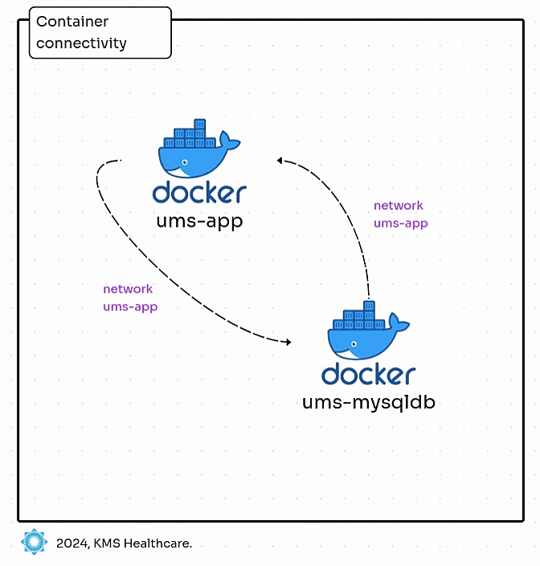

# Deploy Multi-Container applications in Docker



---

## Step 1: Introduction

In this guide, we will deploy a multi-container application using Docker, including:

1. Creating a **Docker network**.
2. Launching a **MySQL database container**.
3. Deploying a **User Management WebApp container** connected to MySQL.
4. Verifying WebApp features (login, listing, and creating users).
5. Cleaning up Docker resources.

---

## Step 2: MySQL Database Container

We'll begin by setting up the MySQL container to manage the application's backend database.

### MySQL Container Setup

```bash
# List existing Docker networks
docker network ls

# Create a new Docker network for the multi-container application
docker network create ums-app

# List networks to verify the creation of the new network
docker network ls

# List any existing Docker containers
docker ps

# Create and run the MySQL container
docker run -d \
  --network ums-app --network-alias mysql \
  --name ums-mysqldb \
  -v ums-mysql-data:/var/lib/mysql \
  -e MYSQL_ROOT_PASSWORD=dbpassword11 \
  -e MYSQL_DATABASE=webappdb \
  -p 3306:3306 \
  mysql:8.0
```

**Explanation:**

- **`--network ums-app --network-alias mysql`**: Connects the MySQL container to the custom network with the alias `mysql`, making it accessible by this name to other containers.
- **`-v ums-mysql-data:/var/lib/mysql`**: Mounts a Docker volume for data persistence.
- **Environment Variables**:
  - `MYSQL_ROOT_PASSWORD`: The MySQL root user password.
  - `MYSQL_DATABASE`: Pre-creates a database named `webappdb`.

### Verify MySQL Container

```bash
# List running containers to verify MySQL is running
docker ps -f "name=ums"

# List Docker volumes to check that the volume for MySQL data is created
docker volume ls

# Connect to the MySQL container
docker exec -it ums-mysqldb mysql -u root -pdbpassword11

# MySQL commands to verify the database
mysql> show schemas;
mysql> use webappdb;
mysql> show tables;
mysql> exit;

# Expected Output:
# The schema `webappdb` should be present as it was pre-created for the application.
```

### Get MySQL Container IP Address

```bash
# Fetch the IP address of the MySQL container
docker inspect -f '{{range.NetworkSettings.Networks}}{{.IPAddress}}{{end}}' ums-mysqldb
```

---

## Step 3: Test the Importance of the `--network-alias` Flag

We'll test the DNS resolution within the Docker network to understand how the alias `mysql` works.

```bash
# Run a troubleshooting container to test MySQL DNS resolution
docker run --name ums-test-mysql-dns -it --network ums-app nicolaka/netshoot

# Inside the container, run the dig command to test DNS
dig mysql

# Observation:
# The alias `mysql` should resolve to the IP address of the MySQL container, confirming the containers can communicate using DNS within the same Docker network.
```

---

## Step 4: User Management WebApp Container

Now we'll set up the User Management WebApp container, which will connect to the MySQL container.

### Pull and Run the WebApp Container
- [Docker Image: ghcr.io/stacksimplify/usermgmt-webapp-v6:latest](https://github.com/users/stacksimplify/packages/container/package/usermgmt-webapp-v6)
```bash
# Pull the User Management WebApp image
docker pull ghcr.io/stacksimplify/usermgmt-webapp-v6:latest

# Run the WebApp container and link it to the MySQL container
docker run -d \
  --network ums-app \
  --name ums-app \
  -e DB_HOSTNAME=mysql \
  -e DB_PORT=3306 \
  -e DB_NAME=webappdb \
  -e DB_USERNAME=root \
  -e DB_PASSWORD=dbpassword11 \
  -p 8080:8080 \
  ghcr.io/stacksimplify/usermgmt-webapp-v6:latest
```

**Explanation:**

- **Environment Variables**: These connect the WebApp to the MySQL container:
  - `DB_HOSTNAME`: The hostname is set to `mysql` (the alias created).
  - `DB_PORT`: Port number of MySQL (3306).
  - `DB_NAME`, `DB_USERNAME`, `DB_PASSWORD`: Credentials for the MySQL database.

### Verify the WebApp

```bash
# List running containers to verify both MySQL and WebApp are running
docker ps -f "name=ums"

# View logs of the WebApp container to ensure successful startup
docker logs -f ums-app
```

---

## Step 5: Verify and Access the Application

### Check Database for Users

```bash
# Connect to the MySQL container to verify the WebApp has interacted with the database
docker exec -it ums-mysqldb mysql -u root -pdbpassword11

# MySQL commands to check the user data
mysql> show schemas;
mysql> use webappdb;
mysql> show tables;
mysql> select * from user;

# Observation:
# After WebApp initialization, a default admin user should be present in the `user` table.
```

### Access the WebApp

1. Open your browser and navigate to [http://localhost:8080](http://localhost:8080).
2. Use the default credentials to log in:

   - **Username**: `admin101`
   - **Password**: `password101`

### Create a New User in the WebApp

1. Create a new user with the following details:

   - **Username**: `admin102`
   - **Password**: `password102`
   - **First Name**: `fname102`
   - **Last Name**: `lname102`
   - **Email**: `email102@kalyan.com`
   - **SSN**: `ssn102`

2. Log in with the newly created user.

---

## Step 6: Clean-Up

Once you're done with the deployment, clean up the Docker environment.

```bash
docker rm -f $(docker ps -aq -f "name=ums")

# Delete All Docker Images
docker rmi $(docker image ls -qa --filter 'reference=*mysql*')

# Delete Docker volumes (optional)
docker volume rm ums-mysql-data
```

---

## Conclusion

In this guide, you successfully deployed:
- A multi-container application using Docker.
- A **MySQL container** as the backend, linked with a **User Management WebApp container**.
- Verified the WebApp's interaction with MySQL for user operations like login, creation, and listing.

Docker networks enable container connectivity, making it essential for complex microservices architectures.

---
