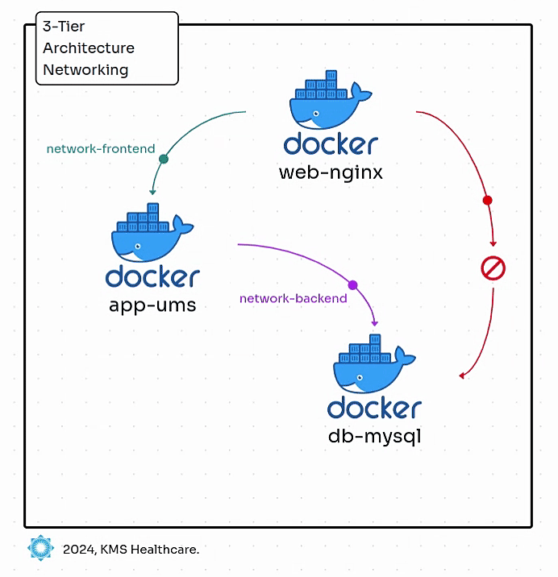

# Docker Compose: Multi-Tier Networking



---

## Step 1: Introduction

This setup illustrates a multi-tier application with isolated networks:

- **`frontend` network**: Connects `web-nginx` (reverse proxy) and `app-ums` (web app) for direct communication.
- **`backend` network**: Links `app-ums` and `db-mysql`, isolating the database from external-facing services for security.

**Key Points**:
- `web-nginx` communicates with `app-ums` over `frontend`.
- `app-ums` interacts with `db-mysql` over `backend`.
- Services use DNS-based discovery (e.g., `db-mysql` via `DB_HOSTNAME`) for seamless interaction.

---

## Step 2: Review docker-compose.yaml

```yaml
name: ums-stack
services:
  web-nginx:
    image: nginx:latest
    container_name: ums-nginx
    ports:
      - "8080:8080"
    depends_on:
      - app-ums
    volumes:
      - ./nginx.conf:/etc/nginx/nginx.conf
    networks:
      - frontend

  app-ums:
    image: ghcr.io/stacksimplify/usermgmt-webapp-v6:latest
    ports:
      - "8080"
    deploy:
      replicas: 2
    depends_on:
      - db-mysql
    environment:
      - DB_HOSTNAME=db-mysql
      - DB_PORT=3306
      - DB_NAME=webappdb
      - DB_USERNAME=root
      - DB_PASSWORD=dbpassword11
    networks:
      - frontend
      - backend

  db-mysql:
    container_name: ums-mysqldb
    image: mysql:8.0-bookworm
    restart: always
    environment:
      MYSQL_ROOT_PASSWORD: dbpassword11
      MYSQL_DATABASE: webappdb
    ports:
      - "3306:3306"
    volumes:
      - mydb:/var/lib/mysql
    networks:
      - backend

volumes:
  mydb:

networks:
  frontend:
  backend:
```

---

## Step 3: Start the Stack

```bash
# Change directory
cd $(git rev-parse --show-toplevel)/b28-Docker-Compose-NETWORKS/networks-demo

# Pull Docker Images and Start Containers
docker compose up -d

# List Docker Containers
docker compose ps
```

---

## Step 4: Verify and Inspect Docker Networks

```bash
# List Docker Networks
docker network ls

# Inspect specific Docker Network - FRONTEND
docker network inspect ums-stack_frontend | jq

# Inspect specific Docker Network - BACKEND
docker network inspect ums-stack_backend | jq
```

---

## Step 5: `web-nginx` Verify Connectivity

- `web-nginx` forwards requests from host port 8080 to `app-ums` via the `frontend` network, using its container name.
- **Isolation**: `web-nginx` cannot access `db-mysql` as it’s not part of the `backend` network.

```bash
# Connect to web-nginx container
docker exec -it ums-nginx /bin/sh

# Debian/Ubuntu-based images: Install iputils
apt-get update
apt-get install -y curl

# Ping Services
curl -v telnet://web-nginx:8080
curl -v telnet://app-ums:8080
curl -v telnet://db-mysql:3306 --output mysql.json.gz

# Observation:
# 1. web-nginx and app-ums will work.
# 2. db-mysql will fail as there is NO ACCESS TO backend network.
```

---

## Step 6: `app-ums` Verify Connectivity

- `app-ums` communicates with `db-mysql` via the `backend` network using the hostname `db-mysql` and port `3306`, keeping the database isolated.
- `app-ums` is connected to both `frontend` and `backend` networks, allowing it to interact with `web-nginx` (via `frontend`) and `db-mysql` (via `backend`).
- With two replicas, `app-ums` instances share the same networks and can access `db-mysql`.

```bash
# Connect to app-ums container (one of the replicas)
docker exec -it --user root ums-stack-app-ums-1 /bin/bash

# Debian/Ubuntu-based images: Install iputils
apt-get update
apt-get install -y curl

# Ping Services
curl -v telnet://web-nginx:8080
curl -v telnet://app-ums:8080
curl -v telnet://db-mysql:3306 --output mysql.json.gz

# Observation:
# 1. web-nginx, app-ums, and db-mysql will work.
# 2. app-ums Service needs connectivity to both frontend and backend db.
```

---

## Step 7: `db-mysql` Verify Connectivity

- Connected only to the `backend` network, isolating it from external services like `web-nginx` for added security.
- Only `app-ums` can access the database on port 3306 via the `backend` network.

```bash
# Connect to db-mysql container
docker exec -it ums-mysqldb /bin/bash

# Debian/Ubuntu-based images: Install iputils
cat /etc/os-release

# Ping Services
curl -v telnet://web-nginx:8080
curl -v telnet://app-ums:8080
curl -v telnet://db-mysql:3306 --output mysql.json.gz

# Observation:
# 1. app-ums and db-mysql will work.
# 2. web-nginx has NO ACCESS from db-mysql.
```

---

## Step 8: Clean-up

```bash
# Stop and Remove Containers
docker compose down -v
docker volume prune -af
docker network prune -f
```

---

## Conclusion

### 1. **Isolated Networks**
- `db-mysql` is connected only to the `backend` network, isolating it from `web-nginx` for better security.
- Services communicate internally through Docker networks, minimizing external exposure.

### 2. **Service Discovery**
- Docker’s built-in DNS allows services to be accessed by their names within the network, simplifying multi-container management and scaling.

---
