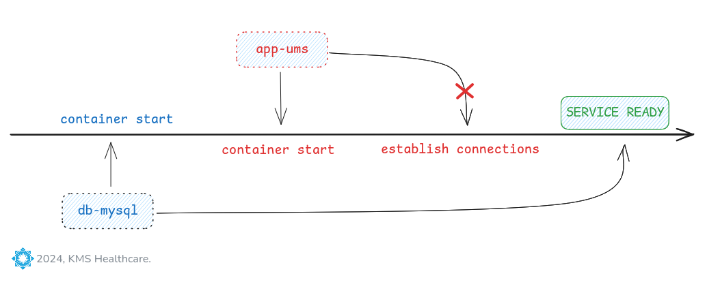

# Docker Compose: Startup Odering



---

## Step 1: Introduction
- Implement startup order using `depends_on` in Docker Compose file

## Step 2: Review docker-compose.yaml
```yaml
# For Service: web-nginx
    depends_on:
      app-ums:
        condition: service_healthy
        restart: true

# For Service: app-ums
    depends_on:
      db-mysql:
        condition: service_healthy
        restart: true
```

## Step 3: Start the Stack
```bash
# Change directory
cd $(git rev-parse --show-toplevel)/b30-Docker-Compose-STARTUP-ORDER/startuporder-demo

# Pull Docker Images and Start Containers
docker compose up -d

# List Docker Containers
docker compose ps -a
# Observation:
# 1. All 3 containers will be created
# 2. First "db-mysql" will become healthy
# 3. Second "app-ums" will become healthy
# 4. Third "web-nginx" will become healthy
# 5. Start happens sequentially "db-mysql" -> "app-ums" -> "web-nginx"
# 6. Live traffic will be allowed only from nginx and nginx is up  only after "db-mysql" and "app-ums" is healthy
```

## Step 4: Clean-up
```bash
# Stop and Remove Containers
docker compose down -v
docker volume prune -af
docker network prune -f
```

## Conclusion

- `depends_on` helps manage **service startup and shutdown order**, but it does not manage **service readiness**.
- It is ideal for scenarios where you need to ensure a **correct initialization sequence** or **controlled shutdown**, but should be paired with health checks for full reliability.

---
